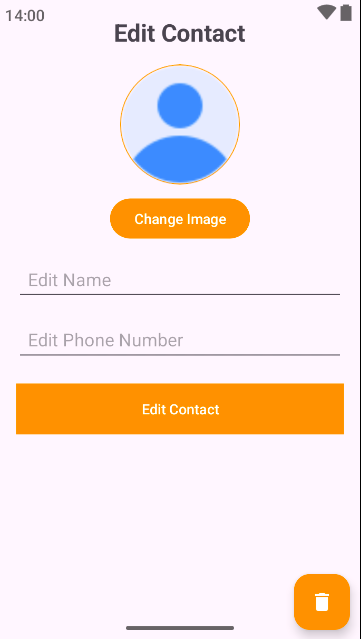

# **ContactApp** 📇  

Welcome to **ContactApp**, a lightweight and efficient mobile application for managing your contacts. Designed with simplicity and functionality in mind, **ContactApp** allows you to effortlessly create, edit, delete, and organize your contacts—all while keeping your data private and secure.  

---

## **Badges**  

  
  
  
  

---

## **Features**  

- **Add Contacts**  
  Quickly add contacts with a name, mobile number, and image.  

- **Edit & Delete Contacts**  
  Update contact details or remove unnecessary contacts effortlessly.  

- **Image Integration**  
  Upload or capture images to associate with your contacts for better identification.  

- **Offline Functionality**  
  Manage contacts without an internet connection using secure local storage.  

- **User-Friendly Interface**  
  Simple and clean design for a seamless user experience.  

---

## **App Screenshots** 📱  

Here’s a preview of the app:  

| Contact List                          | Add Contact                           | Edit Contact                          |
|---------------------------------------|---------------------------------------|---------------------------------------|
|  |   |  |

---

## **How It Works**  

1. Open the app and view your contact list.  
2. Tap **Add Contact** to create a new contact by entering a name, mobile number, and adding an image.  
3. Tap on a contact to edit details or delete the contact if no longer needed.  
4. All changes are saved locally, ensuring your data is always accessible offline.  

---

## **Technical Information**  

- **Platform:** Android  
- **Language:** Kotlin  
- **Database:** SQLite  
- **Requirements:** Android 5.0 (Lollipop) and above  
- **Permissions Required:** Access to storage and camera (for image upload).  

---

## **Privacy and Data Usage**  

This app does not collect, store, or share any personal data externally. All contacts and associated images are securely stored locally on your device.  

---

## **Installation**  

To use this app:  

1. Clone or download the repository.  
2. Open the project in Android Studio.  
3. Build and install the app on your Android device.  
4. Start managing your contacts with **ContactApp**!  

---

## **Future Plans**  

Our roadmap includes:  
- Grouping contacts (e.g., Family, Friends, Work).  
- Adding email and address fields.  
- Enabling cloud backup and sync for cross-device functionality.  

---

## **Contact Us**  

For any issues, feedback, or suggestions, feel free to [open an issue](https://github.com/ishara-madu/ContactApp/issues) or reach out via email at [isharamadushankab@gmail.com](mailto:isharamadushankab@gmail.com).  

---

## **Contributing**  

We welcome contributions! Fork the repository, make your changes, and submit a pull request to help improve **ContactApp**.  

---

## **License**  

This project is licensed under the MIT License - see the [LICENSE](LICENSE) file for details.  

---

**Start managing your contacts with ease using ContactApp!** 📇  
